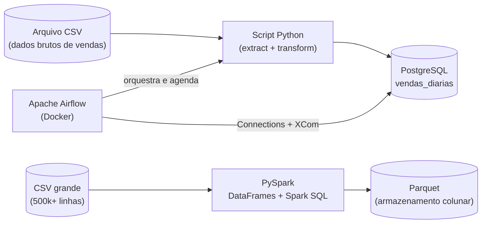

# Pipeline de Análise de Vendas de E-commerce

Pipeline de dados de ponta a ponta que extrai, transforma e carrega dados de vendas, orquestrado com Apache Airflow e preparado para processar grandes volumes com Apache Spark. Projeto construído do zero como parte de um estudo prático de Engenharia de Dados.

## Arquitetura



## Tecnologias utilizadas

- **Python** — extração, transformação e scripts do pipeline
- **PostgreSQL** — armazenamento relacional (schema normalizado: clientes, produtos, pedidos, itens_pedido)
- **Apache Airflow** (via Docker Compose) — orquestração, agendamento e monitoramento do ETL
- **Docker / Docker Compose** — containerização do ambiente de orquestração
- **Apache Spark (PySpark)** — processamento distribuído de grandes volumes, DataFrames e Spark SQL
- **Git/GitHub** — versionamento
- **pytest** — testes automatizados

## O que o pipeline faz

1. **Extract**: lê dados brutos de vendas de um arquivo CSV.
2. **Transform**: converte tipos, calcula valores totais por venda, trata erros (arquivo ausente, dados malformados).
3. **Load**: insere os dados tratados em uma tabela PostgreSQL (`vendas_diarias`), de forma idempotente (a tabela é truncada antes de cada carga, então rodar o pipeline várias vezes não duplica dados).
4. **Orquestração**: todo esse fluxo roda como uma DAG no Apache Airflow, com autenticação segura via Airflow Connections (nenhuma senha exposta em código) e passagem de dados entre tasks via XCom.
5. **Big Data**: um segundo pipeline, em PySpark, demonstra o mesmo tipo de análise (receita por categoria) rodando sobre um dataset de 500 mil registros, comparando também a eficiência do formato Parquet frente ao CSV.

## Estrutura do projeto

```
pipeline-vendas-ecommerce/
├── data/                      # dados de entrada (CSV)
├── processar.py               # primeiro script: leitura e cálculo de totais (Fase 0)
├── pipeline_etl.py            # ETL completo com logging e tratamento de erros
├── gerar_dados_grande.py      # gera dataset sintético de 500k linhas
├── processar_spark.py         # processamento com PySpark (DataFrames + Spark SQL + Parquet)
├── tests/
│   └── test_pipeline_etl.py   # testes automatizados com pytest
└── airflow/
    ├── docker-compose.yaml    # ambiente do Airflow via Docker
    └── dags/
        └── etl_vendas_dag.py  # DAG que orquestra o ETL, com Connections e XCom
```

## Como rodar o projeto

### Pré-requisitos
Python 3, PostgreSQL, Docker e Docker Compose instalados.

### 1. Banco de dados
Crie o banco `ecommerce_db` e um usuário com permissões (veja os comandos SQL no histórico do projeto ou adapte conforme seu ambiente).

### 2. Ambiente Python
```bash
python3 -m venv venv
source venv/bin/activate
pip install psycopg2-binary pytest pyspark
```

### 3. ETL manual (opcional, fora do Airflow)
```bash
python3 pipeline_etl.py
```

### 4. Orquestração com Airflow
```bash
cd airflow
docker compose up -d
```
Acesse `http://localhost:8080` (usuário/senha: `airflow`), cadastre a Connection `postgres_ecommerce` apontando para o seu PostgreSQL, e ative a DAG `etl_vendas_dag`.

### 5. Processamento com Spark
```bash
python3 gerar_dados_grande.py
python3 processar_spark.py
```

### 6. Testes
```bash
pytest
```

## Principais aprendizados

Este projeto foi construído como parte de uma trilha de estudo prática, evoluindo em complexidade a cada etapa: começando com um script Python simples, passando por modelagem relacional em SQL, ETL com tratamento de erros e testes automatizados, orquestração de pipelines com Airflow (incluindo boas práticas como Connections seguras e idempotência), até processamento distribuído de grandes volumes com Spark.

## Autor

Rafael — [github.com/Rafael-Code-Byte](https://github.com/Rafael-Code-Byte)
